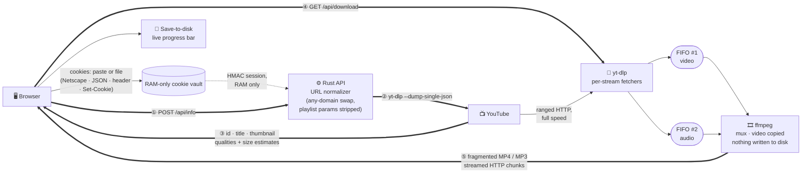

<div align="center">

# 📥 KV-DL

### Self-hosted YouTube downloader — Rust-fast, disk-free, one container

**Paste a link · preview it · pick a quality · stream video+audio or MP3 straight to your browser.**
Nothing ever touches the server's disk.

[](https://github.com/vndangkhoa/kv-dl)
[](https://git.khoavo.myds.me/vndangkhoa/kv-dl)
[](https://hub.docker.com/r/vndangkhoa/kv-dl)
[](https://ghcr.io/vndangkhoa/kv-dl)

`Rust · Axum` `Next.js · Tailwind v4` `yt-dlp · ffmpeg` `v1.1.5`

</div>

---

## ✨ Why KV-DL

| | |
|:---|:---|
| ⚡ **Throttle-proof pipeline** | ffmpeg fetching Googlevideo directly gets throttled below 1 MB/s. KV-DL routes each stream through yt-dlp's fast HTTP stack into kernel pipes (`FIFOs`) and lets ffmpeg *only* do the merging — full-speed downloads (~10–20 MB/s typical). |
| 💾 **Zero-disk by design** | Downloads are merged on the fly and piped straight into the HTTP response. Cookies live in a RAM-only vault behind HMAC-signed sessions. No temp files, nothing logged, nothing retained. |
| 🍪 **Cookies without fuss** | Paste them — no file needed. Netscape `cookies.txt`, JSON exports, `Cookie:` header strings and `Set-Cookie` lines are auto-detected and normalized. Age-restricted videos just work. |
| 🌐 **Any-domain friendly** | The `.com ⇄ your-domain` swap trick adapts itself to whatever domain hosts the instance (derived from `Host` / `X-Forwarded-Host`). Swapped links don't just paste well — **opening one in the browser lands on the app with the video pre-loaded** (`/watch?v=…`, `/shorts/…`, `/embed/…`, `/live/…`), and a leftover `www.` is redirected to the clean form automatically. |
| 📃 **Playlists & channels** | Paste a playlist or channel link and KV-DL detects it, lists every video (fast flat enumeration, capped at 500) with thumbnails/durations, and offers one-click **Download all** — files stream straight into a folder you pick once. |
| 🎬 **Preview before you commit** | Click the thumbnail after fetching to play the real video inline (privacy-friendly `youtube-nocookie` embed) — confirm it's the right one before spending bandwidth. |
| 📊 **Live progress everywhere** | Elapsed-time indicator while YouTube is queried, byte-level progress bar while downloading (with Cancel), and a global download odometer + online-now counter on the page. |
| 🧯 **Self-healing extraction** | Ships a JS runtime for yt-dlp's modern clients, retries transient failures, falls back across player clients and cookie-less modes when logged-in sessions return broken format lists. |
| 📦 **One container, no Node runtime** | The UI compiles to a static bundle served by the Rust binary. ffmpeg + yt-dlp + node included. Runs on any amd64 host — VPS, NAS, Raspberry Pi-class hardware. |

---

## 🔁 Data flow



The same one-liner, minus the ceremony:

```text
yt-dlp ──video──▶ FIFO ─┐
                        ├──▶ ffmpeg ──▶ fragmented MP4 ──HTTP chunks──▶ 💾 browser
yt-dlp ──audio──▶ FIFO ─┘     (mux,     no Content-Length needed,
                          video is copied)   progress tracked client-side
```

If the primary path fails, the API transparently falls back to direct-URL ffmpeg,
then to a `yt-dlp | ffmpeg` pipe — whichever produces data first wins.

---

## 🚀 Quick start

**Development** (hot-reload UI + API):

```sh
cd server && PUBLIC_DIR=../web/out cargo run --release   # terminal 1
cd web && npm install && npm run dev                     # terminal 2 → http://localhost:3000
```

**Production-style single origin:**

```sh
(cd web && npm run build)                                # static export -> web/out
cd server && PUBLIC_DIR=../web/out cargo run --release   # → http://localhost:8080
```

## 🐳 Prebuilt images (recommended)

Multi-stage build: Node compiles the UI → Rust builds the API → final Alpine
runtime ships one binary + static UI + ffmpeg + yt-dlp + node.

```sh
docker run -d -p 8080:8080 vndangkhoa/kv-dl:latest                    # Docker Hub
docker run -d -p 8080:8080 ghcr.io/vndangkhoa/kv-dl:latest            # GHCR
docker run -d -p 8080:8080 git.khoavo.myds.me/vndangkhoa/kv-dl:latest # Forgejo
```

Or with Compose:

```sh
docker compose up --build -d      # build from source, http://localhost:8080
```

## 🖥️ Synology NAS

Use [`docker-compose.synology.yml`](docker-compose.synology.yml) with Container
Manager (DSM 7.2+): drop it into `/volume1/docker/kv-dl/`, create a Project from
that folder, done — it pulls the prebuilt image and persists stats under
`/volume1/docker/kv-dl/data`. Open `http://NAS-IP:8080`.

## 🌍 Deploy on your own domain

1. `docker compose up --build -d` on your VPS.
2. DNS `A` record → your IP.
3. HTTPS proxy — Caddy: `dl.example.net { reverse_proxy 127.0.0.1:8080 }`;
   nginx: keep `proxy_buffering off` so downloads stream through.
4. Set env: `SECRET_KEY`, `SECURE_COOKIES=1`, optional `STATS_FILE`, `COOKIES_FILE`.

Any domain works — the swap suffix derives from the serving host; links shaped
like `https://youtube.<your-domain>/watch?v=…` work out of the box, both for
pasting and for opening straight in the browser.

---

## ⚙️ Configuration

| Variable         | Default | Description                                        |
|------------------|---------|----------------------------------------------------|
| `PORT`           | `8080`  | HTTP port                                          |
| `PUBLIC_DIR`     | `public`| Directory with the built Next.js static export     |
| `SECRET_KEY`     | random  | HMAC key for session cookies (set for restart-stable sessions) |
| `SECURE_COOKIES` | off     | `1` adds the `Secure` flag (use behind HTTPS)      |
| `STATS_FILE`     | –       | JSON file to persist the download counter          |
| `COOKIES_FILE`   | –       | Server-wide fallback `cookies.txt` when a user has none |
| `RATE_INFO_PER_MIN` | `10` | `/api/info` calls per IP per minute |
| `RATE_PLAYLIST_PER_MIN` | `6` | `/api/playlist` calls per IP per minute |
| `RATE_DOWNLOAD_PER_MIN` | `10` | `/api/download` starts per IP per minute |
| `RATE_COOKIES_PER_MIN` | `6` | cookie uploads per IP per minute |
| `DL_CONCURRENCY_PER_IP` | `2` | simultaneous downloads per IP |
| `DL_CONCURRENCY_GLOBAL` | `8` | simultaneous downloads server-wide |
| `VAULT_MAX_SESSIONS` | `1000` | max cookie sessions held in RAM (oldest evicted) |

## 🔌 API

| Endpoint | Method | Purpose |
|---|---|---|
| `/api/info` | POST `{url}` | metadata + selectable formats (auto-retries transient failures) |
| `/api/playlist` | POST `{url}` | playlist/channel enumeration (`--flat-playlist`, capped at 500) — entries with id/title/duration/thumb |
| `/api/download` | GET `?url=&mode=video\|audio&fid=&abr=` | streamed file (strategy chain, logs chosen path) |
| `/api/cookies/upload` \| `/status` \| `/clear` | POST/GET | RAM-only vault. Upload: multipart `file` **or** pasted body (`{"text": …}` / raw text); Netscape/JSON/header/Set-Cookie auto-detected |
| `/api/stats` | GET | `{online, total_downloads}` |
| `/api/health` | GET | liveness |

Every request is line-logged to stdout (`[kv-dl] METHOD path → status (ms)`),
so `docker logs` always tells you what happened.

## 🛡️ Abuse protection

Bots love public downloaders, so the API defends itself out of the box:

| Guard | Default | What it does |
|---|---|---|
| Per-IP rate limits | info 10/min · playlist 6/min · download 10/min · cookies 6/min | fixed-window counters, `429 + Retry-After` when exceeded |
| Download concurrency | 2 per IP, 8 global | extra download requests wait/`429` — protects CPU (yt-dlp/ffmpeg) and bandwidth |
| Cookie vault cap | 1000 sessions | oldest session evicted when full — RAM can't be ballooned |
| `robots.txt` | `Disallow: /api/` | keeps crawlers off the API |
| Security headers | nosniff · DENY framing · referrer policy | applied to every response |
| Body caps | 512 KB cookies · 2 MB requests | enforced server-side |

All limits are env-tunable (`RATE_*`, `DL_*`, `VAULT_MAX_SESSIONS`) — see
[Configuration](#configuration). Client identity prefers
`X-Forwarded-For` (set it in your reverse proxy) and falls back to the peer
address.

**Recommended extra hardening for public deployments:**

- Put **Cloudflare** (free) or a WireGuard/Tailscale tunnel in front — absorbs volumetric floods and hides your IP.
- Caddy/nginx-level connection limits (`rate_limit` / `limit_req`) as a second layer.
- Keep only 80/443 open (`ufw`); SSH via keys only; `fail2ban` for SSH.
- For a private instance, don't expose it publicly at all — Tailscale + firewall allowlist is enough.

## 🧱 Project layout

```
server/   Rust crate (axum): main.rs · normalize.rs · cookies.rs · ytdlp.rs · download.rs
web/      Next.js app: app/page.tsx · components/{Odometer,DemoTypewriter,CookiesPanel,SelfHostModal}.tsx
```

---

> [!WARNING]
> Downloading videos can violate YouTube's Terms of Service and content
> owners' rights. Use responsibly — prefer content you own or that is licensed
> for reuse.

<div align="center">
<sub>Inspired by metube · Powered by yt-dlp & ffmpeg · Built with Rust + Next.js</sub>
</div>
